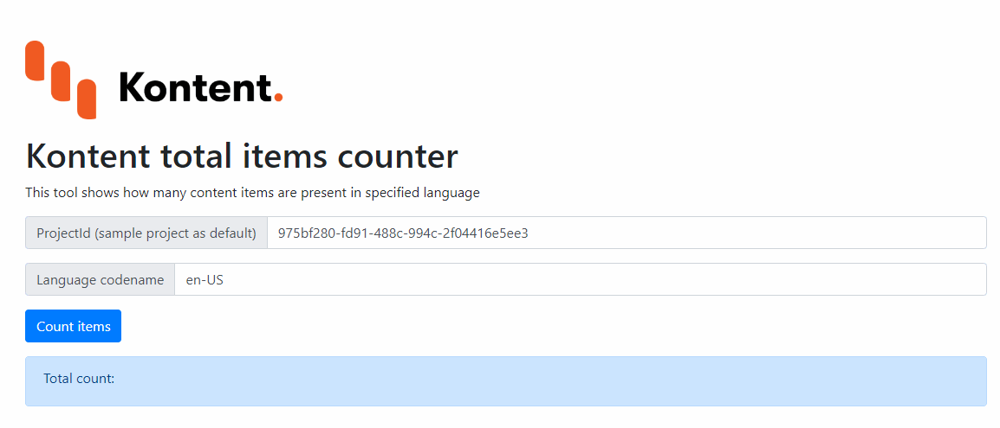

# Kontent total items counter

This tool is able to get the total items count from the [Kontent by Kentico project](https://kontent.ai) CaaS.

To use just go to the [https://Simply007.github.io/kontent-sample-app-total-content-items/counter.html](https://Simply007.github.io/kontent-sample-app-total-content-items/counter.html) and place you project ID and language code name from Kontent project.

Note:

* Works only for [non-secured public projects](https://docs.kontent.ai/tutorials/develop-apps/get-content/securing-public-access#a-retrieving-secured-content)
